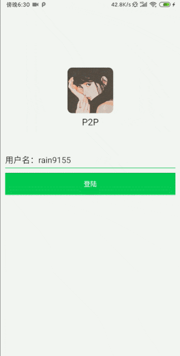
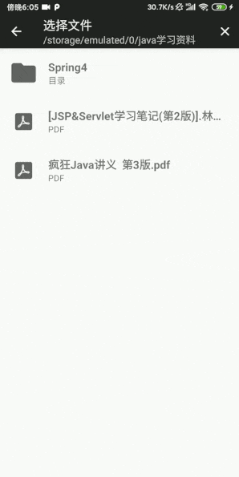

# P2P
### 一个仿微信、基于P2P的局域网即时通信应用，实现了微信的照片选择器，自定义图片加载器，用户通过UDP广播上线，利用TCP来发送消息，支持发送文字、图片(支持多图发送)、表情、语音、文件(支持大文件发送)，关于该应用的设计思路可以查看这篇文章[基于P2P的局域网即时通信应用](https://juejin.im/post/5d2aa766f265da1bc752687b).

## Features

- [x] 可以发送图片、文字、表情、文件、语音，支持多图发送，支持超大文件发送.
- [x] 利用UDP无连接的特点，广播用户上线下线，利用TCP面向连接的特点，建立聊天通道.
- [x] 实现微信的照片选择器，使用ConstraintSet实现了微信发送消息栏的动画交互.
- [x] 参考Glide的核心思想，实现具有生命周期感应能力的图片加载器.
- [x] 通过ArrayDequeu实现消息的排队发送，实现了简单的心跳机制、重连等操作.
- [x] 自定义ConstantHelper，把动画处理逻辑和Activity代码解耦.
- [X] 使用[SVG](https://blog.csdn.net/Rain_9155/article/details/89262144)绘制聊天气饱，满足图片的伸缩性.

## Preview






## Screenshots


## Download
[点击下载apk](https://github.com/rain9155/P2P/raw/master/app/release/app-release.apk)

## Todo

- **用户头像用TCP发送后断开连接的合适时机**

因为发送头像时就已经建立了TCP连接，如果某一方发送完后就断开，会导致另外一方无法发送，所以目前这个问题还没有解决，即TCP连接发送完头像后没有断开，不过考虑到用户有可能会聊天，断不断开也没有关系。

- **聊天记录的保存**

当你这个聊天退出返回后，再次进来，上次的聊天记录没有保存。

- **新信息的提醒**

类似与微信一样，有新消息时列表那里会有红点提示，这个程序中没有这个功能，用户不知道消息的到来。

## Libraries

**自己封装的库**：

[PermissionHelper](https://github.com/rain9155/PermissionHelper) - 简化权限申请过程，一行代码搞定权限申请.

[Loading](https://github.com/rain9155/Loading) - 视图逻辑切换封装，最多二行代码配置加载中、加载失败、空数据视图.

[BaseAdapter](https://github.com/rain9155/BaseAdapter) - 减少Adapter重复代码的编写，支持多种类型的itemType、支持添加自动加载更多和headerView.

**其他优秀的开源库**：

 [MaterialFilePicker](https://github.com/nbsp-team/MaterialFilePicker) - 基于MD风格的文件选择器.

 [Android-Image-Cropper](https://github.com/ArthurHub/Android-Image-Cropper) - 一个Android图片裁剪库.

[Luban](https://github.com/Curzibn/Luban) - 无序繁琐的配置，一行代码搞定图片压缩.

[XPopup](https://github.com/li-xiaojun/XPopup) - 一个功能强大，UI简洁，交互优雅的通用弹窗

## Licensed
```
Copyright 2019 rain9155

Licensed under the Apache License, Version 2.0 (the "License");
you may not use this file except in compliance with the License.
You may obtain a copy of the License a

          http://www.apache.org/licenses/LICENSE-2.0 
          
Unless required by applicable law or agreed to in writing, software
distributed under the License is distributed on an "AS IS" BASIS,
WITHOUT WARRANTIES OR CONDITIONS OF ANY KIND, either express or implied.
See the License for the specific language governing permissions and
limitations under the License.
```
